# Data Cleaning and Preprocessing


```python
# Import necessary libraries
import pandas as pd
import os
import numpy as np

from prettytable import PrettyTable
from tabulate import tabulate

import matplotlib.pyplot as plt
import seaborn as sns
sns.set_style('whitegrid')
from scipy.stats import pearsonr

from sklearn.preprocessing import MinMaxScaler
from sklearn.preprocessing import LabelEncoder
from sklearn.model_selection import train_test_split
from sklearn.tree import plot_tree
from sklearn.tree import DecisionTreeClassifier
from sklearn.metrics import accuracy_score
from sklearn.model_selection import GridSearchCV

# Make the graphs a bit prettier and bigger
plt.style.use('ggplot')
```


```python
files = ['../Data/Data in CSV/DailySummary.csv', 
         '../Data/Data in CSV/DailySleepSummary.csv']

# Read CSV files into dataframes
df_daily_summary = pd.read_csv(files[0])
df_daily_sleep_summary = pd.read_csv(files[1])

# Print columns of dataframes
print(df_daily_summary.columns)
print(df_daily_sleep_summary.columns)

# Drop unnecessary columns
unnecessary_columns_for_daily_summary = ['weight_avg', 'weight_min', 'weight_max', 'calories_goal', 'steps_goal', 'floors_goal', 
                       'sleep_min', 'sleep_max', 'rem_sleep_min', 'rem_sleep_max', 'calories_bmr_avg', 
                       'calories_goal', 'calories_consumed_avg', 'activities', 'activities_calories', 'activities_distance', 
                       'hydration_goal', 'hydration_avg', 'hydration_intake', 'sweat_loss', 'sweat_loss_avg', 'spo2_avg', 
                       'spo2_min','rr_waking_avg', 'rr_min', 'rr_max', 'bb_max', 'bb_min', 'inactive_hr_avg', 'inactive_hr_min',
                       'inactive_hr_max', 'hr_min', 'intensity_time_goal', 'rhr_avg', 'rhr_min', 'rhr_max', 'vigorous_activity_time']  

df_daily_summary.drop(columns=unnecessary_columns_for_daily_summary, inplace=True)

unnecessary_columns_for_daily_sleep_summary = ['avg_spo2', 'avg_rr']
df_daily_sleep_summary.drop(columns=unnecessary_columns_for_daily_sleep_summary, inplace=True)

# Change column names
new_column_names = {
    'sleep_avg': 'total_sleep',
    'rem_sleep_avg': 'rem_sleep',
    'stress_avg': 'stress',
    'calories_avg': 'calories',
    'calories_active_avg': 'calories_active',
    'awake' : 'awake_duration',
    'start' : 'start_time',
    'end' : 'end_time',
    'intensity_time' : 'intensity_duration',
    'moderate_activity_time' : 'moderate_activity_duration',
}

df_daily_summary.rename(columns=new_column_names, inplace=True)

new_column_names_2 = {
    'avg_stress': 'stress',
    'awake' : 'awake_duration',
    'start' : 'start_time',
    'end' : 'end_time'
}

df_daily_sleep_summary.rename(columns=new_column_names_2, inplace=True)

print("\nAfter changes, the columns of the dataframes are: \n")
print(df_daily_summary.columns)
print(df_daily_sleep_summary.columns)
```

    Index(['day', 'hr_avg', 'hr_min', 'hr_max', 'rhr_avg', 'rhr_min', 'rhr_max',
           'inactive_hr_avg', 'inactive_hr_min', 'inactive_hr_max', 'weight_avg',
           'weight_min', 'weight_max', 'intensity_time', 'moderate_activity_time',
           'vigorous_activity_time', 'intensity_time_goal', 'steps', 'steps_goal',
           'floors', 'floors_goal', 'sleep_avg', 'sleep_min', 'sleep_max',
           'rem_sleep_avg', 'rem_sleep_min', 'rem_sleep_max', 'stress_avg',
           'calories_avg', 'calories_bmr_avg', 'calories_active_avg',
           'calories_goal', 'calories_consumed_avg', 'activities',
           'activities_calories', 'activities_distance', 'hydration_goal',
           'hydration_avg', 'hydration_intake', 'sweat_loss_avg', 'sweat_loss',
           'spo2_avg', 'spo2_min', 'rr_waking_avg', 'rr_max', 'rr_min', 'bb_max',
           'bb_min'],
          dtype='object')
    Index(['day', 'start', 'end', 'total_sleep', 'deep_sleep', 'light_sleep',
           'rem_sleep', 'awake', 'avg_spo2', 'avg_rr', 'avg_stress', 'score',
           'qualifier'],
          dtype='object')
    
    After changes, the columns of the dataframes are: 
    
    Index(['day', 'hr_avg', 'hr_max', 'intensity_duration',
           'moderate_activity_duration', 'steps', 'floors', 'total_sleep',
           'rem_sleep', 'stress', 'calories', 'calories_active'],
          dtype='object')
    Index(['day', 'start_time', 'end_time', 'total_sleep', 'deep_sleep',
           'light_sleep', 'rem_sleep', 'awake_duration', 'stress', 'score',
           'qualifier'],
          dtype='object')


## Preprocessing 


```python
# Make sure 'day' is the index in both dataframes
df_daily_summary.set_index('day', inplace=True)
df_daily_sleep_summary.set_index('day', inplace=True)

# Combine dataframes
merged_df = df_daily_summary.combine_first(df_daily_sleep_summary)

# Reset index
merged_df.reset_index(inplace=True)

# Sort by day
merged_df.sort_values(by='day', inplace=True)

# Drop the first row
merged_df = merged_df.drop(merged_df.index[0])

# Drop the rows without qualifier value
merged_df = merged_df.dropna(subset=['qualifier'])
```

### Missing Value Handling


```python
# Display the number of missing values in each column
print(merged_df.isnull().sum())

# Handle numeric missing values by filling with the mean of respective columns
numeric_columns = merged_df.select_dtypes(include=[np.number]).columns.tolist()
merged_df[numeric_columns] = merged_df[numeric_columns].fillna(merged_df[numeric_columns].mean())

print("\nAfter handling missing values: \n")

if merged_df.isnull().sum().sum() == 0:
    print("No missing values in the DataFrame after handling missing values")
else :
    print("Missing values still exist in the DataFrame after handling missing values")
    print(merged_df.isnull().sum())
```

    day                            0
    awake_duration                 0
    calories                       0
    calories_active                0
    deep_sleep                     0
    end_time                       0
    floors                         0
    hr_avg                        15
    hr_max                        15
    intensity_duration             0
    light_sleep                    0
    moderate_activity_duration     0
    qualifier                      0
    rem_sleep                      0
    score                          2
    start_time                     0
    steps                          0
    stress                         0
    total_sleep                    0
    dtype: int64
    
    After handling missing values: 
    
    No missing values in the DataFrame after handling missing values


### Outlier Detection and Handling
- Handle negative stress values
- Impute with mean values of corresponding column


```python
# Outlier calculating using IQR method
def calculate_outliers(df):
    # Select only numeric columns
    numeric_cols = df.select_dtypes(include=[np.number])

    # Calculate Q1, Q3, and IQR on numeric columns
    Q1 = numeric_cols.quantile(0.25)
    Q3 = numeric_cols.quantile(0.75)
    IQR = Q3 - Q1

    # Identify outliers
    # Create a list to store the outlier information
    outlier_info = []

    # Iterate over each column
    for col in numeric_cols.columns:
        # Identify outliers in this column
        col_outliers = (numeric_cols[col] < (Q1[col] - 1.5 * IQR[col])) | (numeric_cols[col] > (Q3[col] + 1.5 * IQR[col]))
        # Add outlier information to the list
        for row in col_outliers[col_outliers].index:
            outlier_info.append({'row': row, 'column': col, 'value': numeric_cols.loc[row, col]})

    # Convert the list to a DataFrame
    outlier_info = pd.DataFrame(outlier_info)

    return outlier_info

outlier_info = calculate_outliers(merged_df)
#print(outlier_info)
```


```python
# Negative STRESS values are due to error -> replace with mean

# Create a boolean mask for rows with outliers
outlier_rows = merged_df.index.isin(outlier_info['row'])

# Calculate the mean of the non-outlier 'STRESS' values
mean_stress = merged_df.loc[~outlier_rows, 'stress'].mean()

# Replace the negative 'STRESS' values in the outliers with the mean
merged_df.loc[outlier_rows & (merged_df['stress'] < 0), 'stress'] = mean_stress

# Replace outliers with the median of the column
for index, row in outlier_info.iterrows():
    merged_df.loc[row['row'], row['column']] = merged_df[row['column']].median()

# Update the outliers 
outlier_info = calculate_outliers(merged_df)

# Now print the DataFrame
print(outlier_info)
```

        row           column        value
    0    91         calories  3083.000000
    1   134         calories  3024.000000
    2    21  calories_active   969.000000
    3    91  calories_active  1028.000000
    4   134  calories_active   963.000000
    5    17           hr_avg    87.569159
    6    43           hr_avg    87.417401
    7   132           hr_avg    87.292060
    8    52           hr_max   163.000000
    9    61           hr_max   162.000000
    10  114           hr_max   162.000000
    11    2            score    50.000000
    12    9            score    49.000000
    13   10            score    49.000000
    14   17            score    47.000000
    15   52            score    50.000000
    16   54            score    40.000000
    17   63            score    50.000000
    18  118            score    49.000000
    19  133            score    41.000000
    20  136            score    47.000000
    21  156            score    49.000000
    22  158            score    43.000000
    23  178            score    52.000000
    24   99           stress    13.000000
    25  104           stress    13.000000
    26  132           stress    48.000000


### Handle time duration values


```python
duration_cols = ['awake_duration', 'rem_sleep', 'total_sleep', 'deep_sleep', 'light_sleep', 'intensity_duration', 'moderate_activity_duration']

# Convert each column to timedelta
for column in duration_cols:
    merged_df[column] = pd.to_timedelta(merged_df[column], errors='coerce')
```

### Handling date values by converting into datetime object


```python
merged_df['day'] = pd.to_datetime(merged_df['day'])
merged_df['start_time'] = pd.to_datetime(merged_df['start_time'])
merged_df['end_time'] = pd.to_datetime(merged_df['end_time'])
```

# Exploratory Data Analysis (EDA)

## Feature Engineering
Derive new features
- active ratio
- stress_level: Refer to [this website](https://www.garmin.com.my/minisite/garmin-technology/health-science/stress-tracking/#:~:text=A%20score%20from%20zero%20to,to%20keep%20stress%20in%20check) for categorization choice
- steps_level
- day_of_week
- 7-day moving average


```python
print(merged_df)
# Feature engineering: New features
# Active Ratio
merged_df['active_ratio'] = merged_df['calories_active'] / merged_df['calories']

# Stress Level Categories
merged_df['stress_level'] = pd.cut(merged_df['stress'], bins=[0, 25, 50, 75, 100], labels=['Rest', 'Low', 'Medium', 'High'])

# Steps Level
merged_df['steps_level'] = pd.cut(merged_df['steps'], bins=[0, 2500, 5000, 7500, 10000, np.inf], labels=['Sedentary', 'Lightly Active', 'Active', 'Very Active', 'Super Active'])

# Day of the Week
# 'day' is in the format 'YYYY-MM-DD'
merged_df['day_of_week'] = pd.to_datetime(merged_df['day']).dt.day_name()

# Calculate the 7-day moving average
merged_df['7_day_avg'] = merged_df['score'].rolling(window=7).mean()
# Order the days of the week
ordered_days = ['Monday', 'Tuesday', 'Wednesday', 'Thursday', 'Friday', 'Saturday', 'Sunday']

average_7_day_avg = merged_df.groupby('day_of_week')['7_day_avg'].mean().reindex(ordered_days)

#print(merged_df.head(1))

print(merged_df['stress_level'].value_counts())
print(merged_df['steps_level'].value_counts())
print(merged_df['day_of_week'].value_counts())
```

    stress_level
    Low       154
    Rest       46
    Medium      3
    High        0
    Name: count, dtype: int64
    steps_level
    Super Active      57
    Active            42
    Very Active       40
    Sedentary         38
    Lightly Active    26
    Name: count, dtype: int64
    day_of_week
    Friday       30
    Monday       30
    Tuesday      30
    Wednesday    29
    Thursday     29
    Sunday       28
    Saturday     27
    Name: count, dtype: int64


```python
# List of columns for activeness
activeness_features = ['calories', 'calories_active', 'steps', 'floors', 'intensity_duration_mins', 'moderate_activity_duration_mins']

# List of columns for the second correlation
sleep_features = ['light_sleep_mins', 'deep_sleep_mins', 'rem_sleep_mins', 'total_sleep_mins', 'score', 'qualifier']
```

## Global Properties of the Dataset


```python
info = merged_df.info()
info
```

    <class 'pandas.core.frame.DataFrame'>
    Index: 203 entries, 1 to 230
    Data columns (total 24 columns):
     #   Column                      Non-Null Count  Dtype          
    ---  ------                      --------------  -----          
     0   day                         203 non-null    datetime64[ns] 
     1   awake_duration              203 non-null    timedelta64[ns]
     2   calories                    203 non-null    float64        
     3   calories_active             203 non-null    float64        
     4   deep_sleep                  203 non-null    timedelta64[ns]
     5   end_time                    203 non-null    datetime64[ns] 
     6   floors                      203 non-null    float64        
     7   hr_avg                      203 non-null    float64        
     8   hr_max                      203 non-null    float64        
     9   intensity_duration          203 non-null    timedelta64[ns]
     10  light_sleep                 203 non-null    timedelta64[ns]
     11  moderate_activity_duration  203 non-null    timedelta64[ns]
     12  qualifier                   203 non-null    object         
     13  rem_sleep                   203 non-null    timedelta64[ns]
     14  score                       203 non-null    float64        
     15  start_time                  203 non-null    datetime64[ns] 
     16  steps                       203 non-null    float64        
     17  stress                      203 non-null    float64        
     18  total_sleep                 203 non-null    timedelta64[ns]
     19  active_ratio                203 non-null    float64        
     20  stress_level                203 non-null    category       
     21  steps_level                 203 non-null    category       
     22  day_of_week                 203 non-null    object         
     23  7_day_avg                   197 non-null    float64        
    dtypes: category(2), datetime64[ns](3), float64(10), object(2), timedelta64[ns](7)
    memory usage: 45.4+ KB


```python
# Get summary statistics
summary = merged_df.describe()
summary
```


<div>
<style scoped>
    .dataframe tbody tr th:only-of-type {
        vertical-align: middle;
    }

    .dataframe tbody tr th {
        vertical-align: top;
    }

    .dataframe thead th {
        text-align: right;
    }
</style>
<table border="1" class="dataframe">
  <thead>
    <tr style="text-align: right;">
      <th></th>
      <th>day</th>
      <th>awake_duration</th>
      <th>calories</th>
      <th>calories_active</th>
      <th>deep_sleep</th>
      <th>end_time</th>
      <th>floors</th>
      <th>hr_avg</th>
      <th>hr_max</th>
      <th>intensity_duration</th>
      <th>light_sleep</th>
      <th>moderate_activity_duration</th>
      <th>rem_sleep</th>
      <th>score</th>
      <th>start_time</th>
      <th>steps</th>
      <th>stress</th>
      <th>total_sleep</th>
      <th>active_ratio</th>
      <th>7_day_avg</th>
    </tr>
  </thead>
  <tbody>
    <tr>
      <th>count</th>
      <td>203</td>
      <td>203</td>
      <td>203.000000</td>
      <td>203.000000</td>
      <td>203</td>
      <td>203</td>
      <td>203.000000</td>
      <td>203.000000</td>
      <td>203.000000</td>
      <td>203</td>
      <td>203</td>
      <td>203</td>
      <td>203</td>
      <td>203.000000</td>
      <td>203</td>
      <td>203.000000</td>
      <td>203.000000</td>
      <td>203</td>
      <td>203.000000</td>
      <td>197.000000</td>
    </tr>
    <tr>
      <th>mean</th>
      <td>2023-09-24 08:37:49.950738944</td>
      <td>0 days 00:12:20.985221674</td>
      <td>2452.330049</td>
      <td>403.182266</td>
      <td>0 days 01:21:20.689655172</td>
      <td>2023-09-24 19:42:51.108374272</td>
      <td>15.105472</td>
      <td>76.654329</td>
      <td>128.920213</td>
      <td>0 days 00:20:56.453201970</td>
      <td>0 days 04:31:31.625615763</td>
      <td>0 days 00:16:44.630541871</td>
      <td>0 days 01:36:35.172413793</td>
      <td>77.114428</td>
      <td>2023-09-24 11:58:45.517241344</td>
      <td>7533.798030</td>
      <td>30.861856</td>
      <td>0 days 07:31:13.571428571</td>
      <td>0.152480</td>
      <td>77.286378</td>
    </tr>
    <tr>
      <th>min</th>
      <td>2023-05-31 00:00:00</td>
      <td>0 days 00:00:00</td>
      <td>2039.000000</td>
      <td>8.000000</td>
      <td>0 days 00:00:00</td>
      <td>2023-05-31 12:33:00</td>
      <td>0.000000</td>
      <td>63.316964</td>
      <td>95.000000</td>
      <td>0 days 00:00:00</td>
      <td>0 days 00:50:00</td>
      <td>0 days 00:00:00</td>
      <td>0 days 00:00:00</td>
      <td>19.000000</td>
      <td>2023-05-31 01:19:00</td>
      <td>328.000000</td>
      <td>11.000000</td>
      <td>0 days 01:43:00</td>
      <td>0.003923</td>
      <td>57.142857</td>
    </tr>
    <tr>
      <th>25%</th>
      <td>2023-07-29 12:00:00</td>
      <td>0 days 00:00:00</td>
      <td>2243.500000</td>
      <td>192.000000</td>
      <td>0 days 01:05:00</td>
      <td>2023-07-30 02:34:30</td>
      <td>2.043470</td>
      <td>72.743540</td>
      <td>118.500000</td>
      <td>0 days 00:00:00</td>
      <td>0 days 03:26:00</td>
      <td>0 days 00:00:00</td>
      <td>0 days 00:53:30</td>
      <td>69.000000</td>
      <td>2023-07-29 18:34:30</td>
      <td>3682.000000</td>
      <td>26.000000</td>
      <td>0 days 06:03:00</td>
      <td>0.085958</td>
      <td>72.000000</td>
    </tr>
    <tr>
      <th>50%</th>
      <td>2023-09-26 00:00:00</td>
      <td>0 days 00:06:00</td>
      <td>2385.000000</td>
      <td>332.000000</td>
      <td>0 days 01:20:00</td>
      <td>2023-09-26 08:30:00</td>
      <td>11.361550</td>
      <td>76.654329</td>
      <td>128.920213</td>
      <td>0 days 00:00:00</td>
      <td>0 days 04:42:00</td>
      <td>0 days 00:00:00</td>
      <td>0 days 01:42:00</td>
      <td>83.000000</td>
      <td>2023-09-25 22:54:00</td>
      <td>7321.000000</td>
      <td>30.000000</td>
      <td>0 days 07:41:00</td>
      <td>0.139098</td>
      <td>77.571429</td>
    </tr>
    <tr>
      <th>75%</th>
      <td>2023-11-20 12:00:00</td>
      <td>0 days 00:17:30</td>
      <td>2595.000000</td>
      <td>535.500000</td>
      <td>0 days 01:40:00</td>
      <td>2023-11-20 20:34:30</td>
      <td>20.413390</td>
      <td>78.962711</td>
      <td>137.000000</td>
      <td>0 days 00:23:30</td>
      <td>0 days 05:31:30</td>
      <td>0 days 00:21:00</td>
      <td>0 days 02:11:30</td>
      <td>88.500000</td>
      <td>2023-11-20 12:23:00</td>
      <td>10689.000000</td>
      <td>35.000000</td>
      <td>0 days 09:05:00</td>
      <td>0.207438</td>
      <td>83.142857</td>
    </tr>
    <tr>
      <th>max</th>
      <td>2024-01-15 00:00:00</td>
      <td>0 days 01:40:00</td>
      <td>5085.000000</td>
      <td>3054.000000</td>
      <td>0 days 02:24:00</td>
      <td>2024-01-15 20:15:00</td>
      <td>230.106300</td>
      <td>112.395155</td>
      <td>184.000000</td>
      <td>0 days 07:46:00</td>
      <td>0 days 08:30:00</td>
      <td>0 days 05:16:00</td>
      <td>0 days 04:32:00</td>
      <td>100.000000</td>
      <td>2024-01-15 17:25:00</td>
      <td>28857.000000</td>
      <td>63.000000</td>
      <td>0 days 12:27:55</td>
      <td>0.600590</td>
      <td>89.285714</td>
    </tr>
    <tr>
      <th>std</th>
      <td>NaN</td>
      <td>0 days 00:17:28.740411291</td>
      <td>335.504267</td>
      <td>333.726931</td>
      <td>0 days 00:26:22.333631078</td>
      <td>NaN</td>
      <td>21.783983</td>
      <td>5.880461</td>
      <td>15.176487</td>
      <td>0 days 00:48:42.944946441</td>
      <td>0 days 01:37:53.347319070</td>
      <td>0 days 00:35:07.001115201</td>
      <td>0 days 00:56:03.369707147</td>
      <td>16.375901</td>
      <td>NaN</td>
      <td>4933.744167</td>
      <td>7.660196</td>
      <td>0 days 02:18:29.586424313</td>
      <td>0.091080</td>
      <td>6.890251</td>
    </tr>
  </tbody>
</table>
</div>


## Distribution of features

### Normalize the dataset


```python
# List of timedelta columns
print(merged_df[duration_cols].dtypes)

for col in duration_cols:
    merged_df[col + '_mins'] = merged_df[col].dt.total_seconds() / 60

print("\nAfter adding _mins columns:")
print(merged_df.head(1))

# Initialize a scaler
scaler = MinMaxScaler()

# Create a new DataFrame for the normalized columns
normalized_df = merged_df.copy()

# List of numerical columns
num_cols = ['calories', 'calories_active', 'floors', 'hr_avg', 'hr_max', 'score', 'steps', 'stress']

# List of columns to normalize
cols_to_normalize = num_cols + [t + '_mins' for t in duration_cols]

# Normalize the columns
normalized_df[cols_to_normalize] = scaler.fit_transform(normalized_df[cols_to_normalize])
```

    awake_duration                timedelta64[ns]
    rem_sleep                     timedelta64[ns]
    total_sleep                   timedelta64[ns]
    deep_sleep                    timedelta64[ns]
    light_sleep                   timedelta64[ns]
    intensity_duration            timedelta64[ns]
    moderate_activity_duration    timedelta64[ns]
    dtype: object
    
    After adding _mins columns:
             day  awake_duration  calories  calories_active      deep_sleep  \
    1 2023-05-31 0 days 00:51:00    2842.0            811.0 0 days 01:06:00   
    
                 end_time    floors     hr_avg  hr_max intensity_duration  ...  \
    1 2023-05-31 12:33:00  16.66339  79.430108   132.0    0 days 00:56:00  ...   
    
      steps_level day_of_week 7_day_avg awake_duration_mins  rem_sleep_mins  \
    1      Active   Wednesday       NaN                51.0           245.0   
    
      total_sleep_mins  deep_sleep_mins  light_sleep_mins intensity_duration_mins  \
    1            623.0             66.0             312.0                    56.0   
    
       moderate_activity_duration_mins  
    1                             56.0  
    
    [1 rows x 31 columns]
    
    After normalization:
             day  awake_duration  calories  calories_active      deep_sleep  \
    1 2023-05-31 0 days 00:51:00  0.263624         0.263624 0 days 01:06:00   
    
                 end_time    floors    hr_avg   hr_max intensity_duration  ...  \
    1 2023-05-31 12:33:00  0.072416  0.328316  0.41573    0 days 00:56:00  ...   
    
      steps_level day_of_week 7_day_avg awake_duration_mins  rem_sleep_mins  \
    1      Active   Wednesday       NaN                0.51        0.900735   
    
      total_sleep_mins  deep_sleep_mins  light_sleep_mins intensity_duration_mins  \
    1         0.806306         0.458333          0.569565                0.120172   
    
       moderate_activity_duration_mins  
    1                         0.177215  
    
    [1 rows x 31 columns]


### Distribution of numerical features


```python
# Filter out rows where 'moderate_activity_duration_mins' and 'intensity_duration_mins' are 0
filtered_df = normalized_df[(normalized_df['moderate_activity_duration_mins'] != 0) & (normalized_df['intensity_duration_mins'] != 0)]

# Define a list of pairs of columns to be plotted together
column_pairs = [
    ['awake_duration_mins', 'rem_sleep_mins', 'total_sleep_mins', 'deep_sleep_mins', 'light_sleep_mins'],
    ['moderate_activity_duration_mins', 'intensity_duration_mins']
]

# Define titles for each plot
titles = [
    'Sleep Phases Density',
    'Activity Duration Density'
]

# Define colors for each column
colors = ['blue', 'red', 'green', 'purple', 'orange', 'yellow']

# Plot active calorie expenditure distribution
fig, axs = plt.subplots(1, 2, figsize=(15, 5))
# Box plot
sns.boxplot(x=filtered_df['calories_active'], color='blue', ax=axs[0])
# Histogram
sns.histplot(filtered_df['calories_active'], kde=True, color='red', ax=axs[1])
# Common title
plt.suptitle('Active Calorie Expenditure Distribution')
plt.tight_layout()
plt.show()

# Plot steps distribution
fig, axs = plt.subplots(1, 2, figsize=(15, 5))
# Box plot
sns.boxplot(x=filtered_df['steps'], color='blue', ax=axs[0])
# Histogram
sns.histplot(filtered_df['steps'], kde=True, color='red', ax=axs[1])
# Common title
plt.suptitle('Step Count Distribution')
plt.tight_layout()
plt.show()

for pair, title in zip(column_pairs, titles):
    plt.figure(figsize=(10, 5))
    for col, color in zip(pair, colors):
        data = filtered_df[col]
        if pair == ['awake_duration_mins', 'rem_sleep_mins', 'total_sleep_mins', 'deep_sleep_mins', 'light_sleep_mins']:
            sns.kdeplot(data, color=color, label=col.capitalize())
        else:
            sns.histplot(data, kde=True, color=color, label=col.capitalize())
    plt.title(title)
    plt.legend(title='Columns')
    plt.show()
```


    
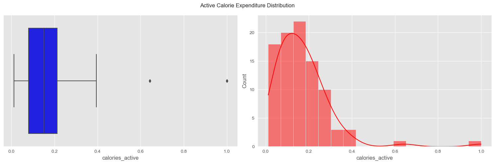
    


    
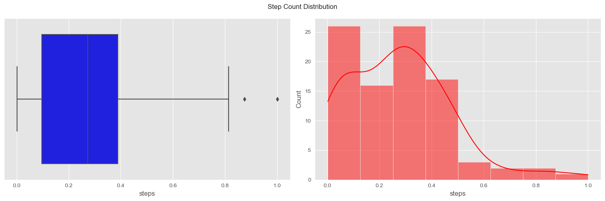
    


    
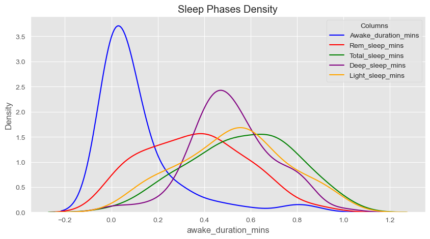
    


    
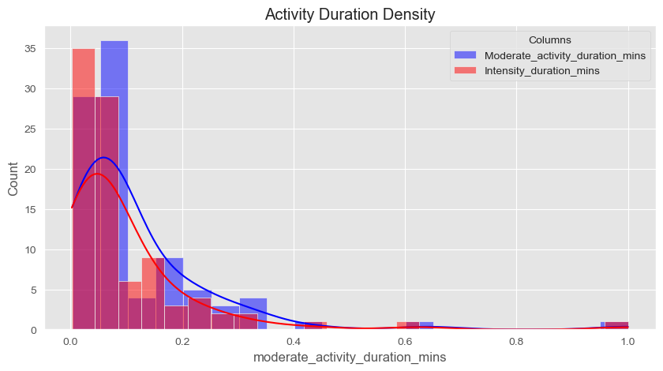
    


### Distribution of sleep start and end times


```python
# Plotting datetime columns as histograms
plt.figure(figsize=(10, 5))

# Define colors for each column
colors = ['blue', 'red']

# Plotting datetime columns as histograms
datetime_cols = ['start_time', 'end_time']
for col, color in zip(datetime_cols, colors):
    sns.histplot(normalized_df[col].dt.hour, kde=True, bins=24, color=color, label=col.capitalize())  # Plot histogram of the hour of the day

plt.xlabel('Hour of the Day')
plt.legend(title='Sleep Time')
plt.show()
```


    
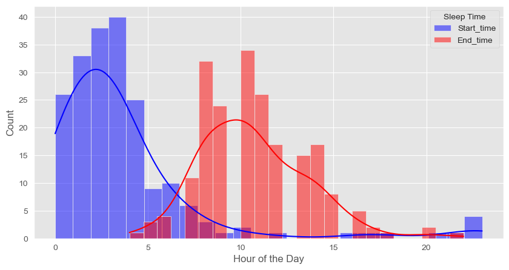
    


### Distribution of sleep quality


```python
merged_df['day'] = pd.to_datetime(merged_df['day'])
merged_df.set_index('day', inplace=True)

merged_df['score'].plot(figsize=(10, 6))
plt.title('Sleep Score Over Time')
plt.show()

# Calculate the 7-day moving average
merged_df['7_day_avg'] = merged_df['score'].rolling(window=7).mean()
```


    
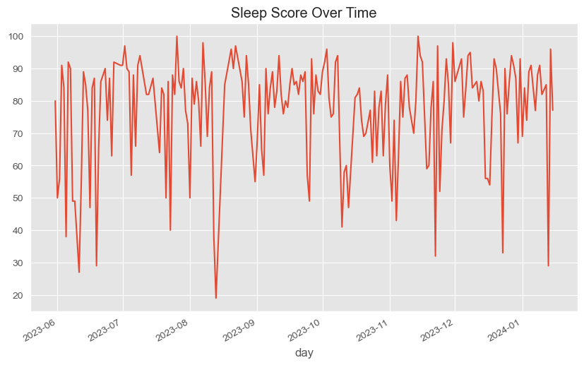
    


```python
# Plotting categorical columns
sns.countplot(x='qualifier', data=normalized_df)
plt.title('Sleep Quality Distribution') 
plt.xticks(rotation=90)
plt.show()
```


    
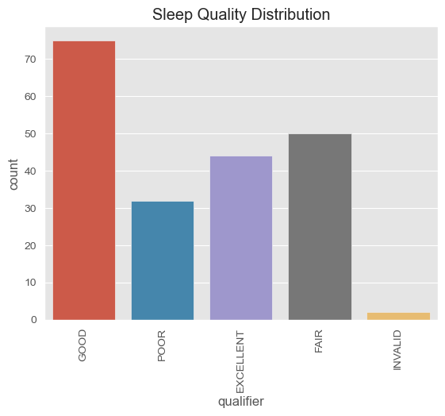
    


## Exploring which days of the week I sleep better & weekly sleep fluctuation
**Finding**:
- It turns out I have a pretty average weekly sleep score of an approximate 80
- From Monday to Tuesday a steep decrease is observed
- From Friday to weekend a steep increase is observed


```python
# Calculate the average sleep score for each day of the week
average_scores = merged_df.groupby('day_of_week')['score'].mean()

average_scores = average_scores.reindex(ordered_days)

# Create a bar plot of the average sleep scores
ax = average_scores.plot(kind='bar', figsize=(10, 6), alpha=0.5, color='b')

# Create a line plot of the 7-day moving average
ax2 = average_7_day_avg.plot(kind='line', marker='o', secondary_y=True, ax=ax)

ax.set_xlabel('') # Hide x-axis label
ax2.set_yticklabels([]) # Hide y-axis labels on secondary y-axis
ax2.set_yticks([]) # Hide y-axis ticks on secondary y-axis
plt.title('Average Sleep Score and 7-Day Moving Average by Day of the Week')
plt.show()
```


    
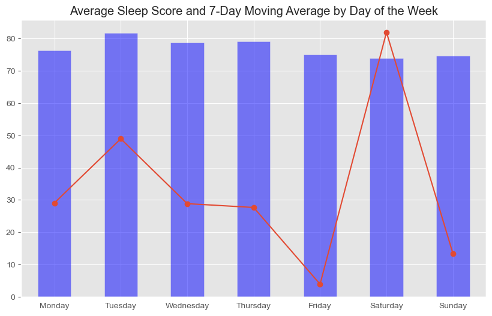
    


## Exploring correlation between stress level and sleep score


```python
# Assuming 'stress' and 'score' are columns in your DataFrame
sns.regplot(x='stress', y='score', data=normalized_df)
plt.show()

# Calculate the correlation matrix
correlation_matrix = normalized_df[['stress', 'score']].corr()
print(correlation_matrix)
```


    
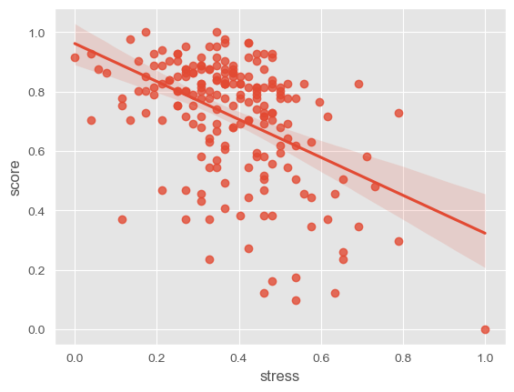
    


              stress     score
    stress  1.000000 -0.465096
    score  -0.465096  1.000000


## Exploring correlation between stress level and physical activity

### Encode stress_level feature


```python
# Create a label encoder
le = LabelEncoder()

# Encode 'stress' and 'stress_level'
normalized_df['stress_encoded'] = le.fit_transform(normalized_df['stress'])
normalized_df['stress_level_encoded'] = le.fit_transform(normalized_df['stress_level'])

# Add 'stress_encoded' and 'stress_level_encoded' to the list of features
features = ['stress_encoded', 'stress_level_encoded'] + activeness_features

# Calculate the correlation matrix
correlation_matrix = normalized_df[features].corr()

# Print the correlation of 'stress_encoded' and 'stress_level_encoded' with each feature
print(correlation_matrix[['stress_encoded', 'stress_level_encoded']])

# Plot the correlation matrix as a heatmap
plt.figure(figsize=(10, 8))
sns.heatmap(correlation_matrix, annot=True, cmap='coolwarm')
plt.title('Correlation Heatmap of Encoded Stress Level and Activeness Features')
plt.show()
```

                                     stress_encoded  stress_level_encoded
    stress_encoded                         1.000000             -0.664706
    stress_level_encoded                  -0.664706              1.000000
    calories                               0.483539             -0.142513
    calories_active                        0.482626             -0.140376
    steps                                  0.306590             -0.065335
    floors                                 0.337258             -0.045378
    intensity_duration_mins                0.070982              0.143305
    moderate_activity_duration_mins       -0.013033              0.207648


    
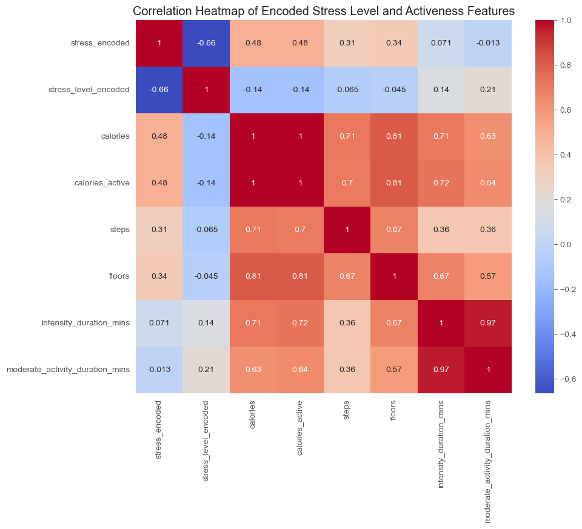
    


```python
# Create a label encoder
le = LabelEncoder()

# Encode 'stress_level'
normalized_df['stress_level_encoded'] = le.fit_transform(normalized_df['stress_level'])

# Add 'stress_level_encoded' to the list of features
features = ['stress_level_encoded'] + activeness_features

# Calculate the correlation matrix
correlation_matrix = normalized_df[features].corr()

# Print the correlation of 'stress_level_encoded' with each feature
print(correlation_matrix['stress_level_encoded'])
```

    stress_level_encoded               1.000000
    calories                          -0.142513
    calories_active                   -0.140376
    steps                             -0.065335
    floors                            -0.045378
    intensity_duration_mins            0.143305
    moderate_activity_duration_mins    0.207648
    Name: stress_level_encoded, dtype: float64


```python
# Plot the correlation matrix as a heatmap
plt.figure(figsize=(10, 8))
sns.heatmap(correlation_matrix, annot=True, cmap='coolwarm')
plt.show()
```


    
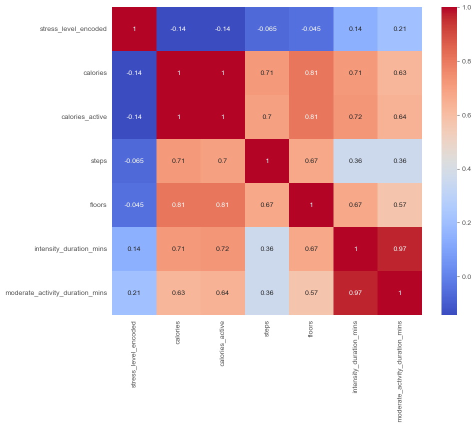
    


## Exploring correlation between sleep features and sleep quality

**Aim**:
- To understand how sleep data are consistent with each other
- Correlation between deep sleep, REM sleep, total sleep, score, and start time. 

**Techniques used:**
- Label encoding is applied to handle string values before seeking correlation

**Finding**:
- Sleep score and sleep durations influence sleep quality positively 
- However, deep sleep duration has low correlation 


```python
# Initialize a label encoder
le = LabelEncoder()

# Fit the label encoder with the 'qualifier' column
le.fit(normalized_df['qualifier'])

# Define the mapping
# reverse the mapping
qualifier_mapping = {'INVALID': 0, 'POOR': 1, 'FAIR': 2, 'GOOD': 3, 'EXCELLENT': 4}
# reverse

# Apply the mapping to the 'qualifier' column
normalized_df['qualifier'] = normalized_df['qualifier'].map(qualifier_mapping)

# Print the unique values in the 'qualifier' column to verify
print(normalized_df['qualifier'].unique())

# Print the unique values and their encoding
for value, encoding in qualifier_mapping.items():
    print(f'{value}: {encoding}')
    
# Print the unique values in the 'qualifier' column of normalized_df that are not in the qualifier_mapping dictionary
print(set(normalized_df['qualifier'].unique()) - set(qualifier_mapping.keys()))
```

    [3 1 4 2 0]
    INVALID: 0
    POOR: 1
    FAIR: 2
    GOOD: 3
    EXCELLENT: 4
    {0, 1, 2, 3, 4}


```python
corr2 = normalized_df[sleep_features].corr()

# Plot the correlation matrix for the second set of columns
plt.figure(figsize=(10, 8))
sns.heatmap(corr2, annot=True, cmap='coolwarm')
plt.title('Correlation between Sleep Features and Sleep Quality')
plt.show()
```


    
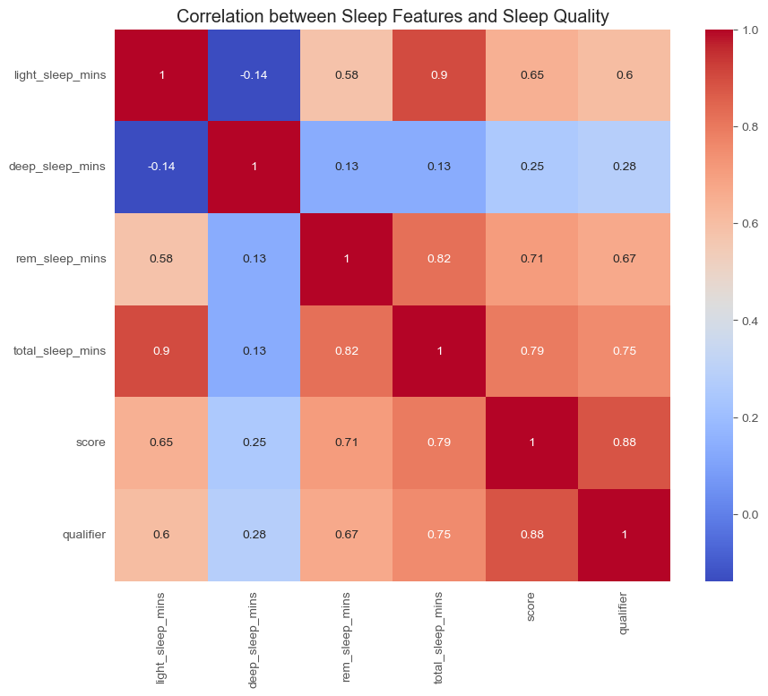
    


## Exploring correlation between physical activity and sleep quality
**Aim:**
- To understand the correlation between activeness and the quality of sleep.
- Specifically, correlation between calories, active calories, average heart rate, maximum heart rate, steps, steps level, floors, intensity time, moderate activity time, and the qualifier. This will help us understand how daily activity levels (activeness) correlate with sleep quality.

**Techniques used:**
- Label encoding is applied to handle string values before seeking correlation
- Kendall's Tau for correlation calculation 
- It is proved that complex ML models such as DecisionTree, RandomForest have low accuracy due to small data size

**Finding:**
- Surprisingly, activeness has slight negative impact on sleep quality and duration 

### Correlation for each feature using **Pearson's Correlation Coefficient** method


```python
# Combine two lists
corr_list = activeness_features + sleep_features

# Calculate the correlation matrix for the first set of columns
corr1 = normalized_df[corr_list].corr()

# Plot the correlation matrix for the first set of columns
plt.figure(figsize=(10, 8))
sns.heatmap(corr1, annot=True, cmap='coolwarm')
plt.title('Correlation between Activeness Metrics and Sleep Quality')
plt.show()
```


    
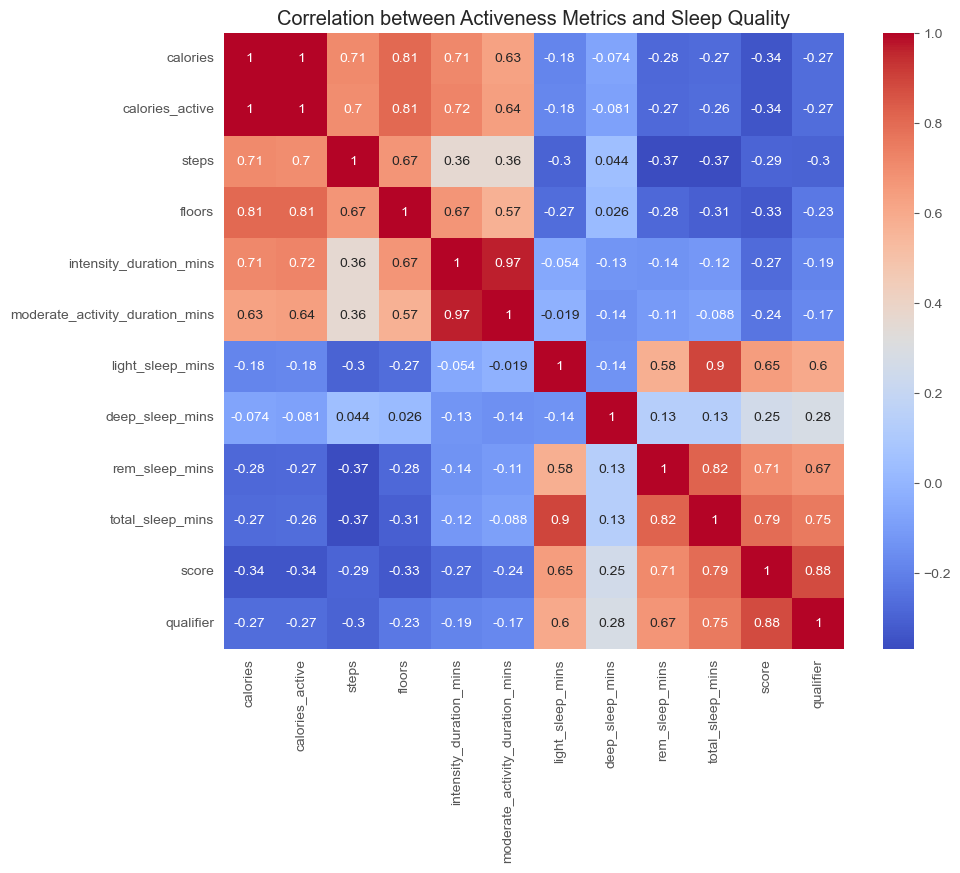
    


### Correlation between activeness and sleep score


```python
corr_with_qualifier = normalized_df[['steps', 'calories_active', 'intensity_duration_mins', 'moderate_activity_duration_mins', 'score']].corr()

#print("Correlation with qualifier:")
#print(corr_with_qualifier)

# Plot the correlation matrix
plt.figure(figsize=(8, 6))
sns.heatmap(corr_with_qualifier, annot=True, cmap='coolwarm')
plt.title('Correlation with Qualifier')
plt.show()
```


    
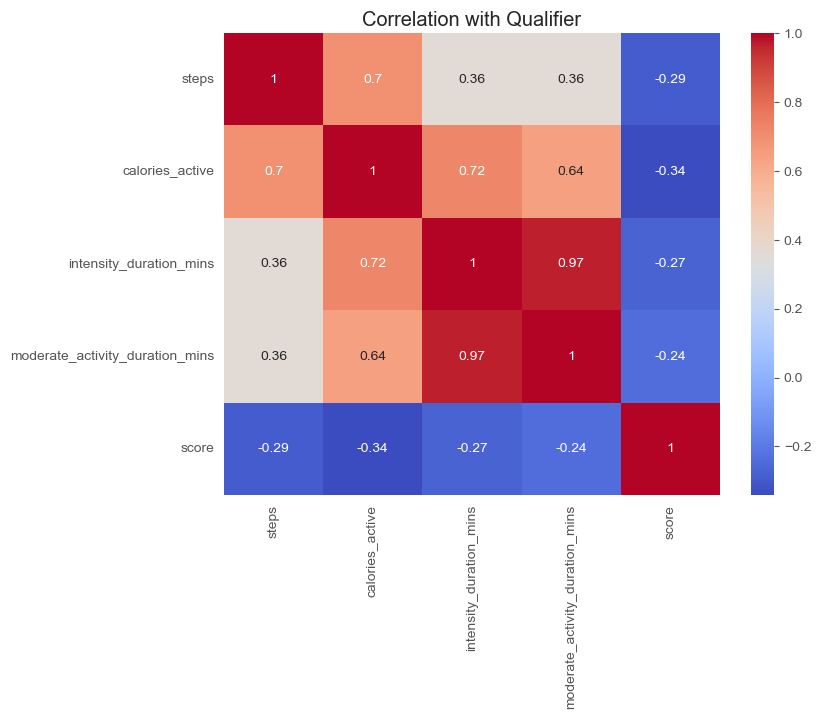
    


### Further analysis of the relationship between activeness and sleep quality using a **decision tree model**


```python
# Define the feature columns and the target column
feature_cols = ['steps', 'calories_active', 'intensity_duration_mins', 'moderate_activity_duration_mins', 'deep_sleep_mins']
target_col = 'qualifier'

# Split the data into training and test sets with stratified sampling
X_train, X_test, y_train, y_test = train_test_split(merged_df[feature_cols], merged_df[target_col], test_size=0.2, random_state=42, stratify=merged_df[target_col])

# Create and fit the decision tree model
model = DecisionTreeClassifier(max_depth=3)
model.fit(X_train, y_train)

# Make predictions on the test set and calculate the accuracy
y_pred = model.predict(X_test)
accuracy = accuracy_score(y_test, y_pred)
print(f'Accuracy: {accuracy}')

# Define the parameter grid
param_grid = {'max_depth': range(1, 10)}

# Create the grid search object
grid = GridSearchCV(DecisionTreeClassifier(), param_grid, cv=5, scoring='accuracy')

# Fit the grid search object to the data
grid.fit(X_train, y_train)

# Print the best parameters and the best score
print(f'Best parameters: {grid.best_params_}')
print(f'Best score: {grid.best_score_}')

# Set up the figure
plt.figure(figsize=(12, 8))

# Get unique class labels
class_names = merged_df[target_col].unique().tolist()

# Plot the decision tree
plot_tree(model, filled=True, feature_names=feature_cols, class_names=class_names)

# Show the plot
plt.show()
```

    Accuracy: 0.43902439024390244
    Best parameters: {'max_depth': 1}
    Best score: 0.36420454545454545


    /Users/h4kcrun/anaconda3/lib/python3.11/site-packages/sklearn/model_selection/_split.py:725: UserWarning: The least populated class in y has only 2 members, which is less than n_splits=5.
      warnings.warn(


    
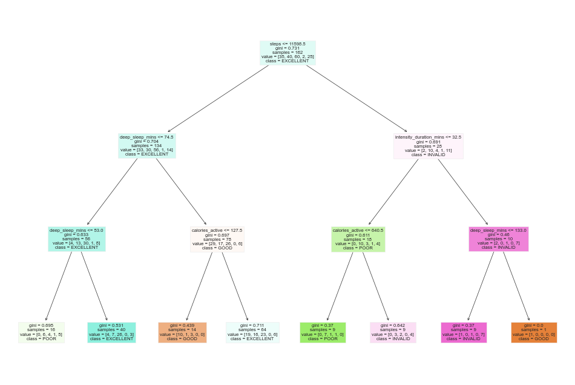
    


### Correlation between physical activity and sleep start time

Using **Pearson's Correlation Coefficient**. Why choose this method?
- SRC does not assume datasets are normally distributed
- Can be used when the relationship is not linear


```python
corr_with_start_time = normalized_df[activeness_features + ['start_time']].corr()
corr_with_start_time = corr_with_start_time.round(2)

# Apply a styling to the correlation matrix
styled_corr_matrix = corr_with_start_time.style.background_gradient(cmap='coolwarm')

# Display the styled correlation matrix
styled_corr_matrix

# Plot the correlation matrix
plt.figure(figsize=(8, 6))
sns.heatmap(corr_with_start_time, annot=True, cmap='coolwarm')
plt.show()
```


    
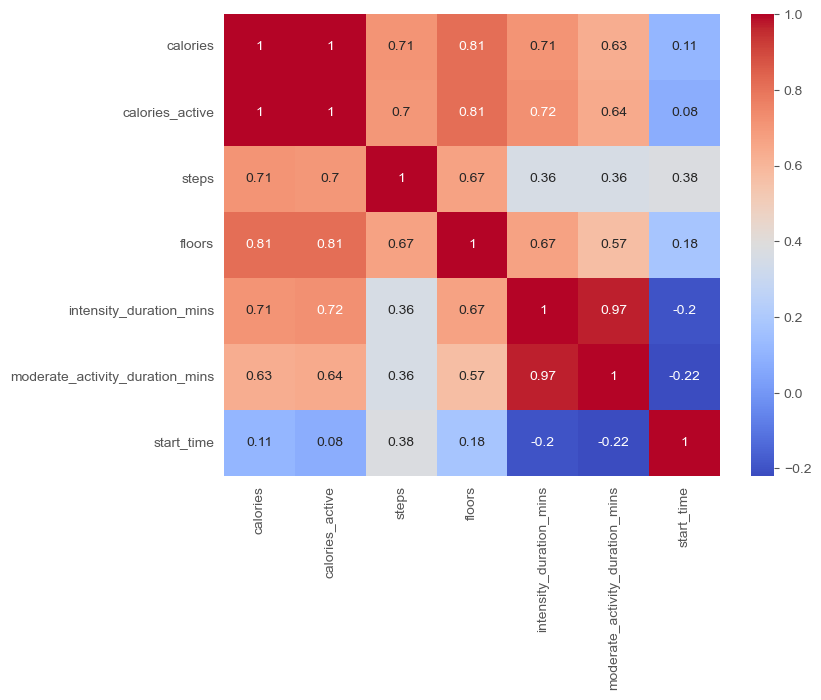
    


# Hypothesis Testing and Statistical Analysis

## Sleep duration ~ Sleep quality
**Null hypothesis:** There is no correlation between sleep duration and sleep quality


```python
correlation, p_value = pearsonr(normalized_df['total_sleep_mins'], normalized_df['score'])

print(f'Correlation: {correlation}')
print(f'P-value: {p_value}')
```

    Correlation: 0.7933056968575266
    P-value: 3.4031811299927094e-45


### Hypothesis testing
Using Pearson correlation test, 
- Correlation: 0.6300386664844899
- p-value: 7.461805108064072e-24
### Conclusion
p-value is extremelly small. Hence, assuming there is no actual corrolation, the probability of observing such strong correlation by chance is extremely low.

Null hypothesis can be rejected. This correlation is statistically significant provides strong evidence for an alternative hypothesis that **as sleep duration increases, sleep quality also increases**.

## Active calorie burned ~ Sleep score
**Null hypothesis:** There's no correlation between active calorie burned and sleep score


```python
from scipy.stats import pearsonr

correlation, p_value = pearsonr(normalized_df['calories_active'], normalized_df['score'])

print(f'Correlation: {correlation}')
print(f'P-value: {p_value}')
```

    Correlation: -0.3409965734840917
    P-value: 6.408701257301692e-07


### Hypothesis testing
Using Pearson correlation test, 
- Correlation: -0.24184153456526303
- p-value: 0.0005086136505719167

### Conclusion
The p-value is extremely small (=< 0.05). Assuming no correlation, this strong correlation cannot occur by chance.

Null hypothesis can be rejected.  Hence this correlation is statistically significant and provides evidence for an alternative hypothesis that **as active calories burned increase, sleep score decreases**

## Step count ~ Sleep start time
**Null hypothesis:** No correlation between step count and sleep start time


```python
# Convert 'start_time' to the number of seconds past 11PM
reference_time = pd.Timestamp('23:00:00')
normalized_df['start_time_seconds'] = ((normalized_df['start_time'] - reference_time).dt.total_seconds()) % (24*3600)

correlation, p_value = pearsonr(normalized_df['steps'], normalized_df['start_time_seconds'])

print(f'Correlation: {correlation}')
print(f'P-value: {p_value}')
```

    Correlation: -0.10461978355479168
    P-value: 0.1374174466450277


### Hypothesis testing
Using Pearson correlation test, 
- Correlation: -0.11377001817658312
- p-value: 0.1060477403348315

### Conclusion
The p-value is higher than 0.05, meaning that assuming there's no correlation, this statistics is not statistically significant as it may be occurred by random chance. No strong evidence against null hypothesis, therefore null hypothesis cannot be rejected. 

## Stress level ~ Sleep quality
**Null Hypothesis**: No correlation between stress level and sleep quality


```python
from scipy.stats import chi2_contingency

# Create a contingency table
contingency_table = pd.crosstab(normalized_df['stress_level'], normalized_df['qualifier'])

# Perform the Chi-square test
chi2, p_value, dof, expected = chi2_contingency(contingency_table)

print(f'Chi-square statistic: {chi2}')
print(f'P-value: {p_value}')
```

    Chi-square statistic: 20.276111210923464
    P-value: 0.009340411516669107


### Hypothesis testing
Using chi-square test
- Chi-square statistic: 12.612769040617142
- p-value: 0.013331362158689679

### Conclusion
The p-value is small (=< 0.05), meaning that there is statistically significant association between stress level and sleep quality. They are not independent. Therefore we can reject the null hypothesis.
